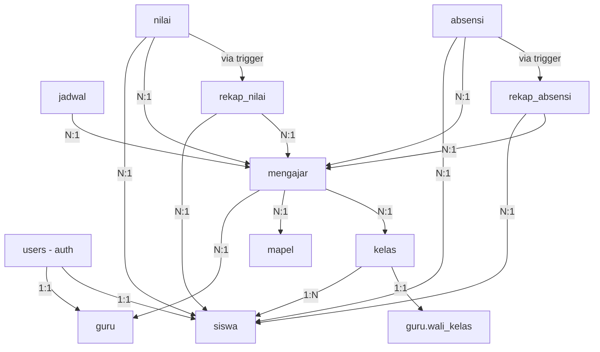
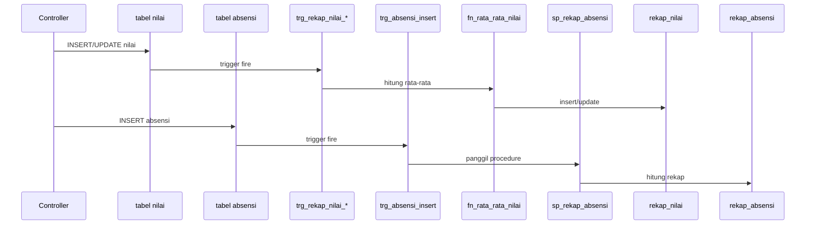

# Analisis Database Sistem Akademik Sekolah

## Overview
Sistem akademik sekolah berbasis Laravel + Blade + MySQL dengan skema database final dan objek SQL terstruktur.

## 1. Hubungan Database (Entity Relationships)



## 2. Functions (MySQL Functions)

### `fn_rata_rata_nilai(p_siswa_id INT, p_mengajar_id INT)`
**Fungsi**: Menghitung rata-rata nilai siswa untuk satu mata pelajaran/semester tertentu.
**Return**: `DECIMAL(5,2)` - rata-rata nilai
**Digunakan oleh**: Trigger `trg_rekap_nilai_insert` dan `trg_rekap_nilai_update`

### `fn_persentase_hadir(p_siswa_id INT, p_mengajar_id INT)`
**Fungsi**: Menghitung persentase kehadiran siswa untuk satu mata pelajaran.
**Return**: `DECIMAL(5,2)` - persentase kehadiran
**Catatan**: Bisa dipakai langsung tanpa menunggu tabel `rekap_absensi` terisi (fallback untuk tampilan).

## 3. Stored Procedures

### `sp_input_nilai_kelas(p_mengajar_id, p_jenis, p_siswa_id, p_nilai, p_user_id)`
**Fungsi**: Input atau update nilai per siswa untuk satu jenis penilaian (tugas/uts/uas).
**Mekanisme**: Menggunakan `ON DUPLICATE KEY UPDATE` pada kolom `(siswa_id, mengajar_id, jenis)`.
**Dipanggil dari**: Controller melalui `DB::statement('CALL ...')`
**Validasi**: Rentang nilai 0-100 dan cross-check siswa-kelas **tidak** dilakukan di procedure ini, harus di controller sebelum memanggil.

### `sp_rekap_absensi(p_siswa_id, p_mengajar_id, p_semester)`
**Fungsi**: Menghitung ulang rekap absensi satu siswa untuk kombinasi `mengajar_id` + `semester`.
**Dipanggil**: **OTOMATIS** oleh trigger `trg_absensi_insert`
**Catatan**: JANGAN dipanggil manual dari controller.

## 4. Triggers

### `trg_rekap_nilai_insert`
- **Event**: `AFTER INSERT ON nilai`
- **Aksi**: Insert/update ke tabel `rekap_nilai` dengan memanggil `fn_rata_rata_nilai()`
- **Unik**: Semester diambil dinamis dari tabel `mengajar.semester`

### `trg_rekap_nilai_update`
- **Event**: `AFTER UPDATE ON nilai`
- **Aksi**: Sinkronkan ulang `rekap_nilai` saat nilai diedit
- **Penting**: Tanpa trigger ini, rekap tidak akan berubah saat guru mengedit nilai yang sudah ada

### `trg_log_nilai_update`
- **Event**: `AFTER UPDATE ON nilai`
- **Aksi**: Menyimpan log audit trail ke tabel `log_perubahan` dalam format JSON
- **Data**: Mencatat nilai lama dan baru

### `trg_absensi_insert`
- **Event**: `AFTER INSERT ON absensi`
- **Aksi**: Memanggil `sp_rekap_absensi` dengan semester dari tabel `mengajar`
- **Pattern**: Sama dengan trigger nilai untuk mencegah salah catat semester

## 5. Alur Otomatis Rekap Data



## 6. Constraints Kritis

### Unique Keys Wajib:
- `nilai`: `(siswa_id, mengajar_id, jenis)` - fondasi `ON DUPLICATE KEY UPDATE`
- `absensi`: `(siswa_id, mengajar_id, tanggal)` - mencegah absensi ganda
- `rekap_nilai`: `(siswa_id, mengajar_id, semester)`
- `rekap_absensi`: `(siswa_id, mengajar_id, semester)`

### Validasi yang Tidak Dijamin FK (wajib di Controller):
1. **Rentang nilai**: `0 ≤ nilai ≤ 100`
2. **Kecocokan siswa-kelas**: Cek `siswa.kelas_id` sama dengan `kelas_id` dari `mengajar` sebelum insert
3. **Role-based access control**: Middleware untuk endpoint per role

## 7. Eksekusi Urutan File SQL

**Urutan WAJIB**: Functions → Procedures → Triggers
```bash
mysql -u root -p nama_database < docs/02-sql-objects.sql
```

**Verifikasi setelah eksekusi**:
```sql
SHOW FUNCTION STATUS WHERE Db = DATABASE();
-- harus muncul: fn_rata_rata_nilai, fn_persentase_hadir

SHOW PROCEDURE STATUS WHERE Db = DATABASE();
-- harus muncul: sp_input_nilai_kelas, sp_rekap_absensi

SHOW TRIGGERS;
-- harus muncul: trg_rekap_nilai_insert, trg_rekap_nilai_update,
--              trg_log_nilai_update, trg_absensi_insert
```

## 8. Aturan Penggunaan

### ✅ BOLEH dilakukan:
- Memanggil `sp_input_nilai_kelas` dari controller
- Membaca data dari tabel rekap untuk tampilan
- Menggunakan fungsi `fn_persentase_hadir` sebagai fallback

### ❌ TIDAK BOLEH dilakukan:
- CRUD manual ke tabel `rekap_nilai` dan `rekap_absensi`
- Memanggil `sp_rekap_absensi` manual dari controller
- Mengubah isi `docs/02-sql-objects.sql`
- Membuat controller tanpa validasi cross-check siswa-kelas
- Menambahkan FK langsung dari `nilai`/`absensi` ke `guru`/`mapel`/`kelas`

---

**Versi Dokumentasi**: Berdasarkan `docs/01-schema.md` dan `docs/02-sql-objects.sql`
**Status Skema**: FINAL (tidak boleh diubah)
**Terakhir Diperbarui**: 2026-09-15